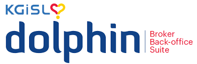

# Dolphin Overview

Dolphin Retail is a software tool developed by KGiSL for stockbroking companies. It is a back end operations tool. It helps them manage clients, trades, money and rules of SEBI

## Key Features 

It helps them in followings
* **Client Management**
It stores all the client imformation at one place and manage their accounts.

* **Trade Processing**
Everytime client buy and sell the shares. Dolphin records the trades and ensures everything is in order.

* **Reports & Compliance**
It automatically generates reports that follow SEBI rules. So you stay compliant without extra efforts

## Why Dolphin?

* It saves time by automating many task at back office. 
* Reduce errors and keeps data accurate.
* Helps with audits and SEBI complaince.
* Supports large operations across many branches.
* Makes it easy for client to see their date online.

ddefceerf
kkkk

  
### Heading 3 for Dolphin
this is another content